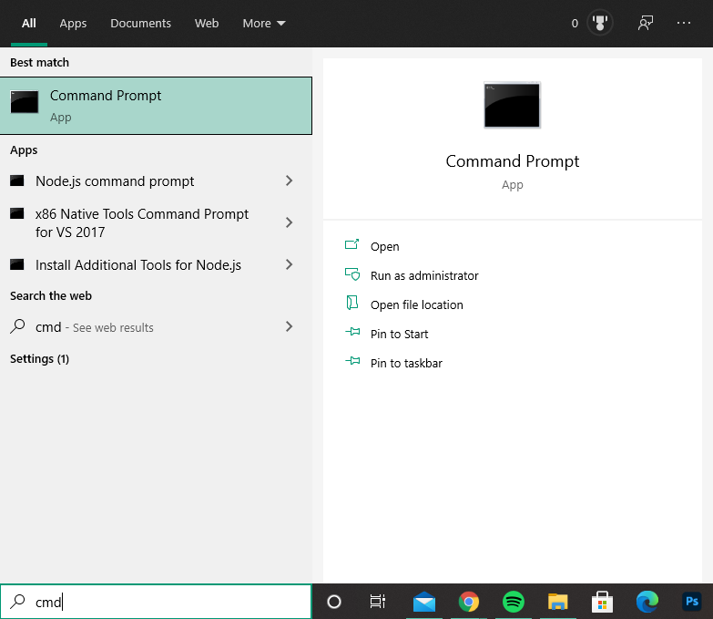
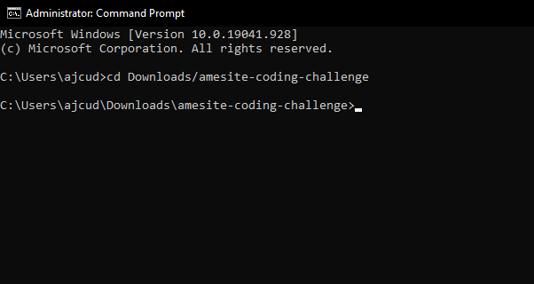
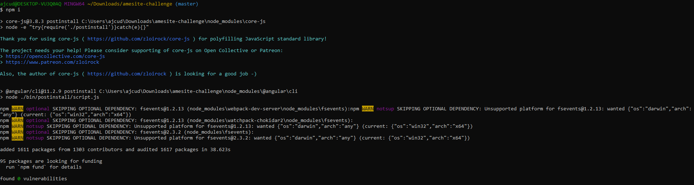
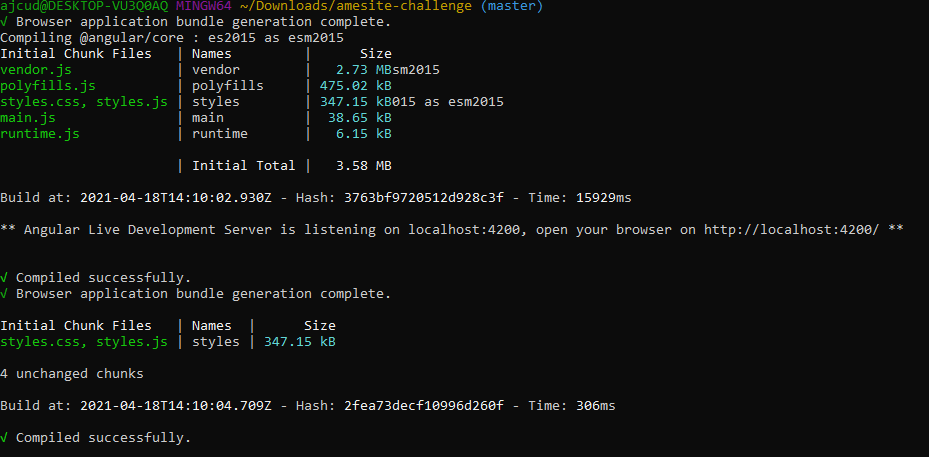
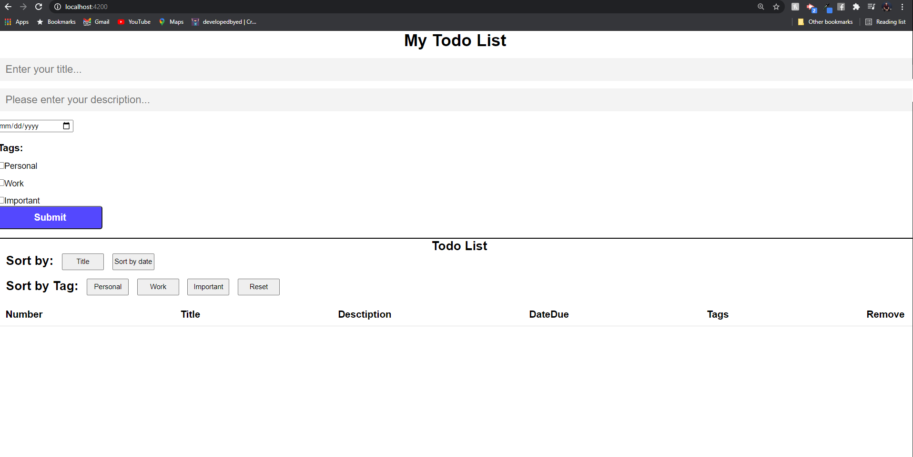

# Todo App

## Table of Contents:

- [Purpose](#purpose)
- [Instructions](#instructions)
- [Technologies](#technologies)
- [Features](#features)

## Purpose

- A simple to use todo application allowing a user to add and delete todo's, sort todo's by tags, and sort todo's by both date and alphabeticly by title.

## Instructions

- ** Important ** You will need to have Angular and Node.js installed on your computer in order to run this code.

### **If you have angular's CLI and Node.js installed on your computer already, you can skip the next 2 steps.**

### Installing Node.js

- To install node.js, please visit https://nodejs.org/en/ to install the recommended version of node.js.
- Once you have Node.js installed on your computer, open your terminal and type `node -v` and press enter. If a version comes up, you have successfully installed Node. If you are getting errors, please refer to this video to properly install: https://www.youtube.com/watch?v=qZQmCfkmbNA

### Installing Angular.js CLI

- Once you have successfully installed node.js, you will need to now install Angular.js on your machine. To install Angular, open your terminal and type `npm install -g @angular/cli`.
- Once angular's CLI is installed, you will now be able to run the project.

### Running the todo application

- Please clone this project to your local machine.
- Once you have the project downloaded, open a new terminal.

- Use the command cd to navigate to the downloaded folder's location. For example, if I downloaded the folder to my downloads folder, I would type `cd Downloads/amesite-challenge` from my root directory.

- Once you are in the amesite-challenge directory, type `npm i` to install all dependencies, this could take a minute or two.

- Once the download is successful, type `ng serve` and hit enter. This will start a server for you so you are able to view the website

- Once the terminal says it was compiled successfully, open your browser and navigate to localhost:4200. You should now see the Todo List Application and can add, delete and sort your todos!

## Technologies

- Angular.js

## Features

- Clean user interface
- Easy to use website
- Create with Angular CLI and Angular.js
- Add and delete todo's
- Sort your todo's!
